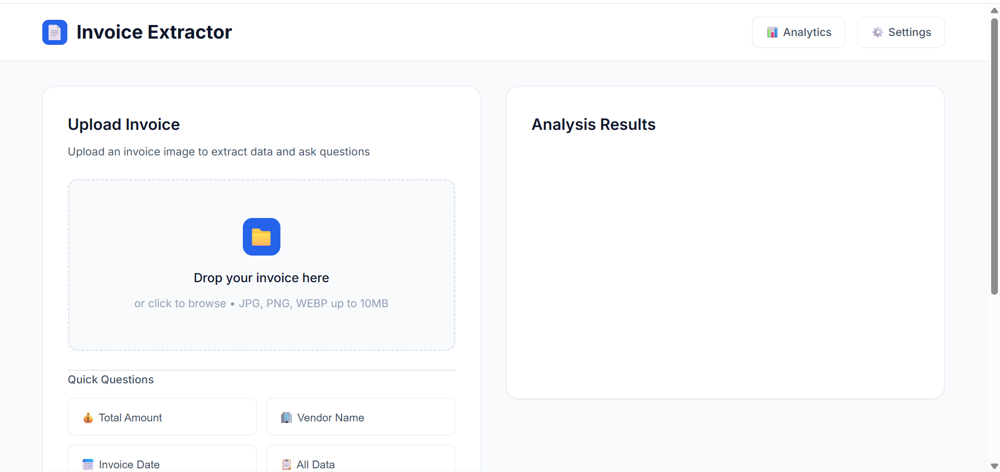
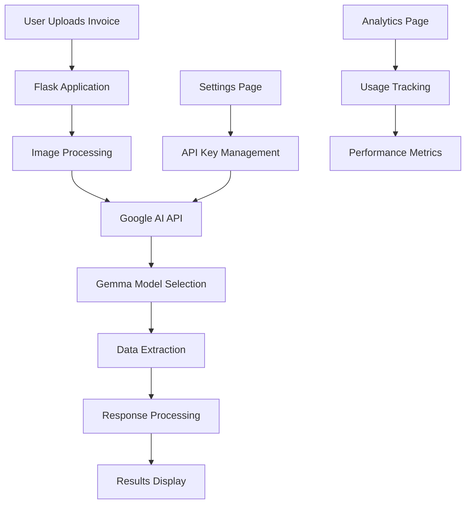

<div align="center">

# 📄 Invoice Extractor

[](https://python.org)
[](https://flask.palletsprojects.com/)
[](https://ai.google.dev/)
[](https://multilanguage-invoice-extractor-1.onrender.com)
[](LICENSE)

**AI-Powered Multilingual Invoice Data Extraction**

[🌐 Live Demo](https://multilanguage-invoice-extractor-1.onrender.com) • [📖 Documentation](#features) • [🚀 Quick Start](#quick-start)

---

</div>

## 🎯 Overview

Invoice Extractor is an intelligent web application that leverages Google's Gemma AI models to extract and analyze data from invoice images. Whether you need to quickly find the total amount, vendor name, invoice date, or extract all available data, this tool provides accurate results with high confidence levels.

<div align="center">



*Clean, modern interface for effortless invoice analysis*

</div>

## ✨ Features

### 🤖 **AI-Powered Analysis**
- **Multiple AI Models**: Choose from Gemma 3 27B IT (Recommended), Gemma 3 12B IT (Balanced), Gemma 3 4B IT (Fast), Gemini 2.0 Flash, and Gemini 2.5 Flash
- **High Accuracy**: Achieve up to 95% confidence in data extraction
- **Multilingual Support**: Process invoices in various languages

### 📊 **Quick Analysis Options**
- 💰 **Total Amount** - Instantly extract monetary values
- 🏢 **Vendor Name** - Identify company/supplier information  
- 📅 **Invoice Date** - Extract date information
- 📋 **All Data** - Comprehensive data extraction

### 🎨 **Modern Interface**
- **Responsive Design** - Works seamlessly on desktop and mobile
- **Drag & Drop Upload** - Intuitive file handling
- **Real-time Processing** - Instant analysis results
- **Clean UI** - Minimalist, professional design

### 🔧 **Advanced Features**
- **Multiple File Formats** - Support for JPG, PNG, WEBP (up to 10MB)
- **API Key Management** - Secure configuration through settings
- **Analytics Dashboard** - Track usage and performance
- **Session Management** - Persistent user preferences

## 🚀 Quick Start

### Prerequisites
- Python 3.10 or higher
- Google AI API key ([Get yours here](https://ai.google.dev/))

### Installation

1. **Clone the repository**
   ```bash
   git clone https://github.com/yourusername/invoice-extractor.git
   cd invoice-extractor
   ```

2. **Create virtual environment**
   ```bash
   python -m venv venv
   source venv/bin/activate  # On Windows: venv\Scripts\activate
   ```

3. **Install dependencies**
   ```bash
   pip install -r requirements.txt
   ```

4. **Configure environment**
   ```bash
   # Create .env file
   echo "GOOGLE_API_KEY=your_api_key_here" > .env
   ```

5. **Run the application**
   ```bash
   python app.py
   ```

6. **Access the application**
   Open your browser and navigate to `http://localhost:5000`

## 🏗️ Architecture



## 🛠️ Technology Stack

| Component | Technology | Purpose |
|-----------|------------|---------|
| **Backend** | Flask | Web framework and API |
| **AI Engine** | Google Generative AI | Invoice analysis and data extraction |
| **Image Processing** | Pillow (PIL) | Image handling and optimization |
| **Frontend** | HTML5, CSS3, JavaScript | Responsive user interface |
| **Deployment** | Render | Cloud hosting and scaling |
| **Environment** | Python 3.10+ | Runtime environment |

## 📁 Project Structure

```
invoice-extractor/
├── 📄 app.py                 # Main Flask application
├── 📋 requirements.txt       # Python dependencies
├── ⚙️ render.yaml           # Deployment configuration
├── 🖼️ image.png            # Application screenshot
├── 📁 static/
│   └── styles.css           # Custom styling
├── 📁 templates/
│   ├── index.html           # Main interface
│   ├── analytics.html       # Analytics dashboard
│   └── settings.html        # Configuration page
└── 📖 README.md            # Project documentation
```

## 🔧 Configuration

### Environment Variables
```bash
GOOGLE_API_KEY=your_google_ai_api_key_here
```

### Model Selection
The application supports multiple AI models with different performance characteristics:

| Model | Speed | Accuracy | Use Case |
|-------|-------|----------|----------|
| **Gemma 3 27B IT** | Slow | Highest | Production analysis |
| **Gemma 3 12B IT** | Medium | High | Balanced performance |
| **Gemma 3 4B IT** | Fast | Good | Quick analysis |
| **Gemini 2.0 Flash** | Very Fast | Good | Experimental |
| **Gemini 2.5 Flash** | Fast | High | Preview features |

## 🌐 Deployment

### Render Deployment
The application is configured for easy deployment on Render:

1. **Fork this repository**
2. **Connect to Render**
3. **Set environment variables**
4. **Deploy automatically**

[](https://render.com/deploy)

## 📊 Usage Examples

### Basic Invoice Analysis
1. Upload an invoice image (JPG, PNG, or WEBP)
2. Select your preferred AI model
3. Choose a quick question or ask a custom question
4. Get instant, accurate results

### Custom Queries
Beyond the quick questions, you can ask custom questions like:
- "What is the payment terms?"
- "List all line items with quantities"
- "What is the tax amount?"
- "Extract the billing address"

## 🤝 Contributing

We welcome contributions! Here's how you can help:

1. **Fork the repository**
2. **Create a feature branch** (`git checkout -b feature/amazing-feature`)
3. **Commit your changes** (`git commit -m 'Add amazing feature'`)
4. **Push to the branch** (`git push origin feature/amazing-feature`)
5. **Open a Pull Request**

## 📈 Performance

- **Processing Time**: 2-5 seconds per invoice
- **Accuracy**: Up to 95% confidence
- **File Size Limit**: 10MB maximum
- **Supported Formats**: JPG, PNG, WEBP
- **Concurrent Users**: Handles multiple simultaneous requests

## 🔒 Security

- **API Key Protection**: Secure session-based storage
- **File Validation**: Type and size verification
- **Input Sanitization**: Protection against malicious uploads
- **HTTPS Support**: Secure data transmission


<div align="center">

**Made with ❤️ using Flask and Google AI**

[](https://github.com/yourusername/invoice-extractor)
[](https://github.com/yourusername/invoice-extractor)

</div>
